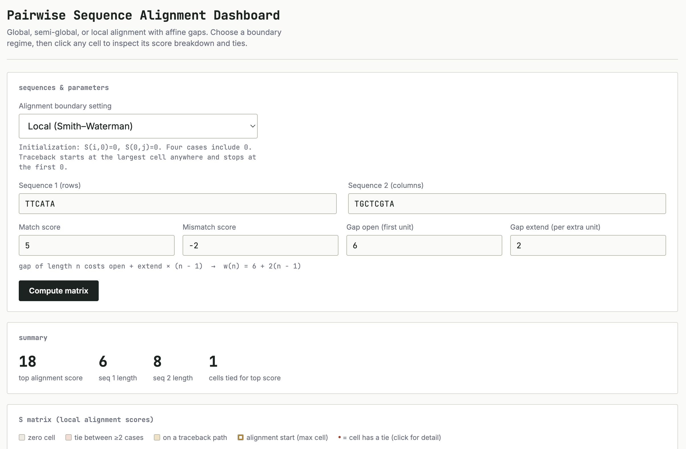
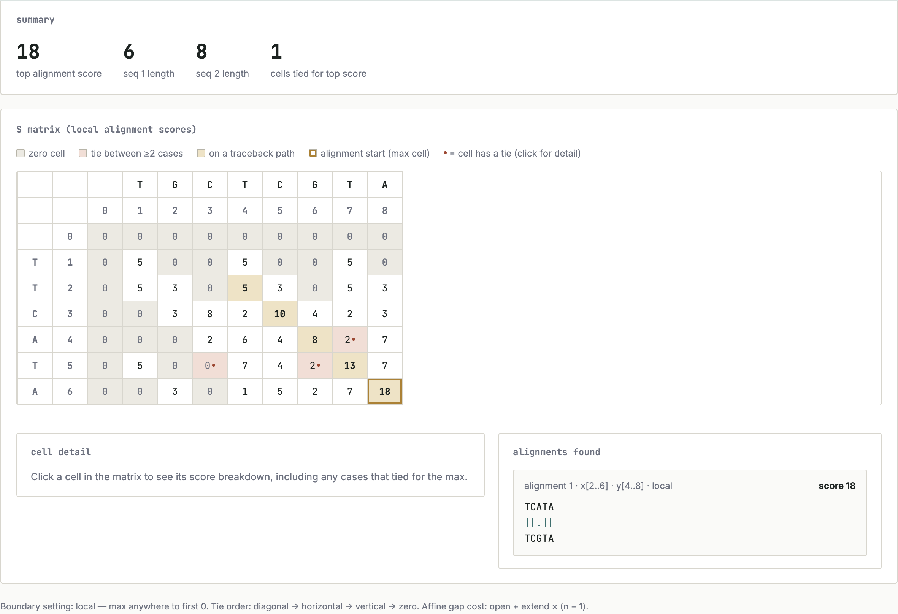

# Interactive Pairwise Sequence Alignment Dashboard

An interactive browser-based dashboard for exploring **global, semi-global, and local pairwise sequence alignment** using dynamic programming.

The application allows users to compare how different alignment boundary conditions and scoring parameters affect the resulting alignment, score, gap structure, and dynamic programming matrix.

🔗 **Live Demo:**  
https://mviolant.github.io/sequence-alignment-matrix-dashboard/

## Dashboard Preview

### Inputs and Scoring



### Matrix and Alignment Output



## Overview

Pairwise sequence alignment can produce very different results depending on whether the goal is to align complete sequences, allow unpenalized terminal gaps, or identify only the best matching subsequences.

This dashboard implements three alignment regimes:

- **Global alignment**
- **Semi-global alignment**
- **Local alignment**

Users can switch between alignment modes while keeping the same sequences and scoring parameters, making it possible to directly observe how boundary conditions affect the optimal alignment.

## Alignment Modes

### Global Alignment

Global alignment attempts to align both sequences across their entire lengths.

It is most appropriate when the sequences are expected to be similar over most or all of their lengths.

### Semi-global Alignment

Semi-global alignment allows terminal portions of the sequences to remain unaligned without receiving the same penalties associated with internal gaps.

This can be useful when one sequence represents a fragment of another or when terminal overhangs should not dominate the alignment score.

### Local Alignment

Local alignment identifies the highest-scoring subsequences within the two input sequences.

This is useful when only part of the sequences is expected to share strong similarity.

## Features

- Global, semi-global, and local alignment modes
- Interactive alignment-regime selector
- Dynamic programming matrix visualization
- Customizable:
  - Match score
  - Mismatch penalty
  - Gap-opening penalty
  - Gap-extension penalty
- Affine gap scoring
- Traceback visualization
- Optimal alignment output
- Alignment score
- Gap reporting
- Sequence-length reporting
- Alignment coordinates for local alignments
- Input validation
- Deterministic tie handling
- Interactive per-cell scoring information

## Dynamic Programming

Pairwise sequence alignment uses a scoring matrix in which each cell represents the best alignment score for prefixes of the two sequences.

Possible transitions include:

```text
Diagonal   → match or mismatch
Horizontal → gap in one sequence
Vertical   → gap in the other sequence
```

The initialization and traceback rules depend on the selected alignment regime.

Changing those boundary conditions allows the same dynamic programming framework to produce global, semi-global, or local alignments.

## Example Comparison

Consider:

```text
Sequence X: TTCATA
Sequence Y: TGCTCGTA

Match: +5
Mismatch: -2
Gap open: 6
Gap extend: 2
```

The optimal result changes depending on the alignment regime.

### Global

```text
T--TCATA
TGCTCGTA
```

Score: **15**

### Semi-global

```text
--TTCATA
TGCTCGTA
```

Score: **16**

### Local

```text
TCATA
TCGTA
```

Score: **18**

This example demonstrates that the definition of an optimal alignment depends not only on the scoring parameters but also on the biological assumptions represented by the boundary conditions.

## Affine Gap Penalties

The dashboard supports affine gap penalties.

Rather than assigning the same cost to every gap position, affine scoring separates:

- **gap opening**
- **gap extension**

This allows the algorithm to distinguish between starting a new insertion/deletion event and extending an existing one.

Changing the gap-opening penalty can therefore alter both the alignment score and the structure of the resulting alignment.

## Testing and Validation

The dashboard was evaluated using predefined sequence-alignment test cases designed to examine:

- boundary-condition behavior
- affine gap penalties
- traceback decisions
- gap-opening conventions
- invalid sequence input
- expected versus observed alignment scores

Testing different parameter combinations helped identify both expected algorithmic behavior and implementation limitations.

## Technologies

- HTML
- CSS
- JavaScript
- Git / GitHub
- GitHub Pages

## Project Context

Developed as part of graduate-level coursework in **Bioinformatics and Genomics at UNC Charlotte**.

This project is intended as an educational implementation and visualization of sequence-alignment algorithms. It is not intended to replace optimized production bioinformatics software.

## Author

**Maria Violante**  
M.S. Bioinformatics Candidate  
UNC Charlotte

GitHub: https://github.com/mviolant
